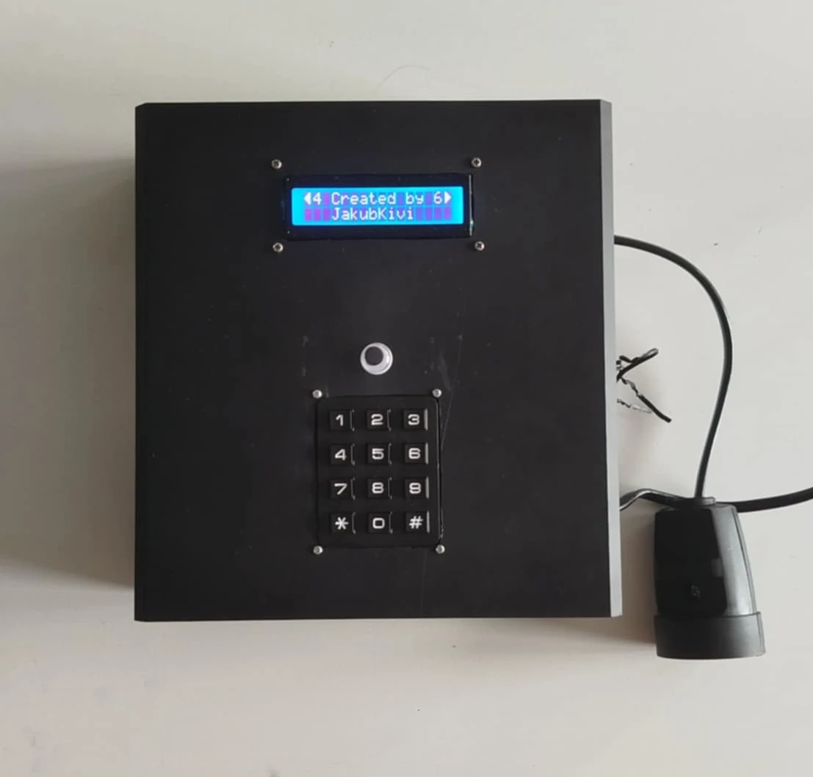

# K-Pillar

K-Pillar is a fully automated plant watering system controlled by an Arduino Nano with a custom expansion board. It supports up to three independent watering schedules configurable via an LCD and keypad interface, with all settings saved to EEPROM for power-loss resilience. The system also includes a programmable relay for controlling additional devices like grow lights, and is designed with low-power consumption in mind using efficient C++ classes.

More info [here](https://jakubkivi.github.io#portfolio-modal-k-pillar)
